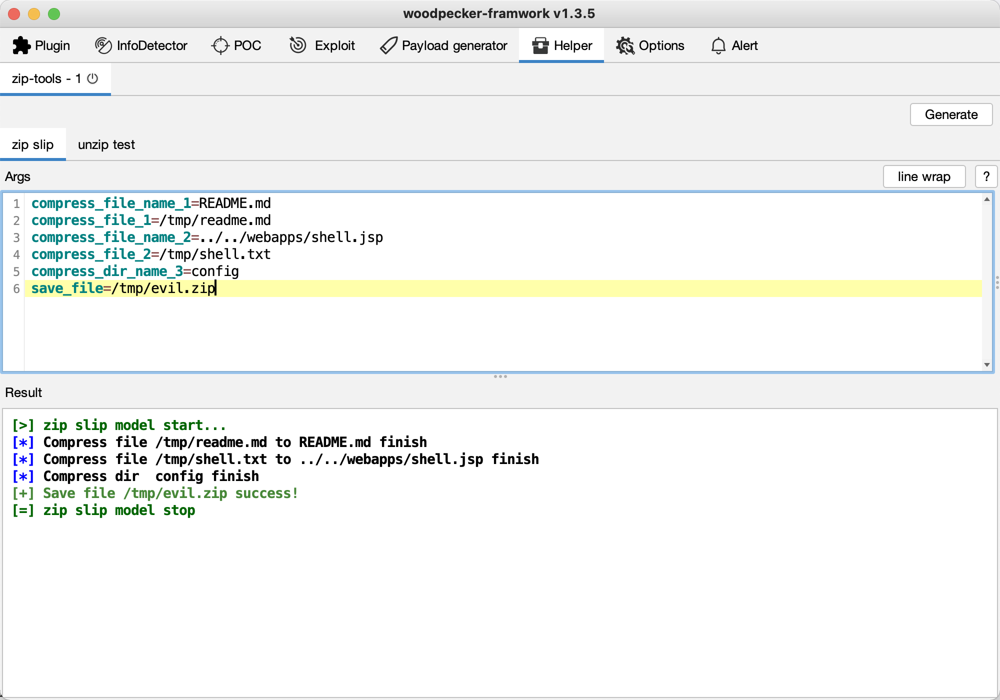

# zip-tools

## 0x01 简介
`zip-tools`是 [woodpecker框架](https://github.com/woodpecker-framework/woodpecker-framwork-release/releases) 生成各类恶意zip文件的辅助插件。

* [x] zip slip
* [ ] ascii zip
* [ ] zip add dirty data

## 0x02 使用
生成一个可目录穿到`..\..\..\webapps\shell.jsp`的压缩文件

测试解压效果，验证是否生效

